# 💖 LinkUp – Chatting App

**LinkUp** is a modern and stylish real-time chatting application built using **Flutter** and **Firebase**.  
The app provides smooth messaging, secure authentication, and a beautiful onboarding experience.

---

## 📌 App Details

- **App Name:** LinkUp  
- **Category:** Social / Chat Application  
- **Platform:** Android  
- **Framework:** Flutter  
- **Backend:** Firebase  

**Tagline:** *Connect. Chat. LinkUp.*

---

## ✨ Features

- 🔐 Email & Google Authentication  
- 💬 Real-time One-to-One Chat  
- 👤 User Profile Setup  
- 🎂 Birthday & Gender Selection  
- 🖼 Avatar Upload  
- 📨 Recent Chats & New Chat  
- 🎨 Clean Gradient UI  
- 🚪 Secure Logout  

---

## 🛠 Tech Stack

- Flutter (Dart)
- Firebase Authentication
- Cloud Firestore
- Firebase Storage
- Material Design

---

## 📱 App Screens (Full Walkthrough)

### 🟣 Splash Screen
**Welcome to LinkUp**  
First impression screen with app logo and gradient background.

<p align="center">
  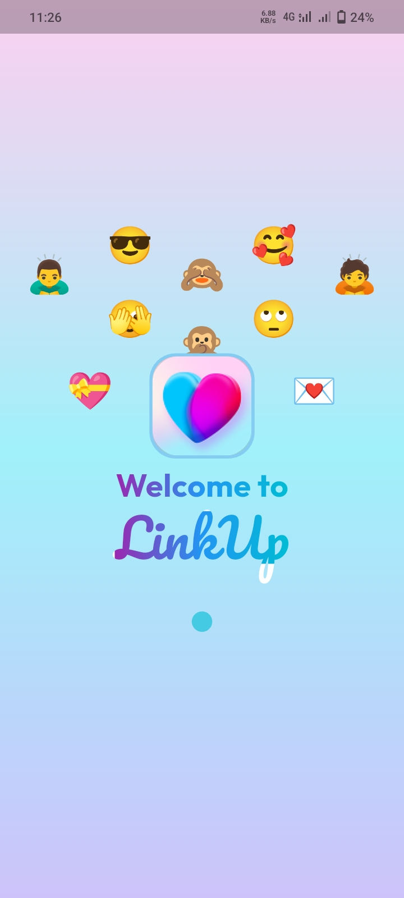
</p>

---

### 🟣 Onboarding Screen
**Get Started**  
Brief introduction about the app and its purpose.

<p align="center">
  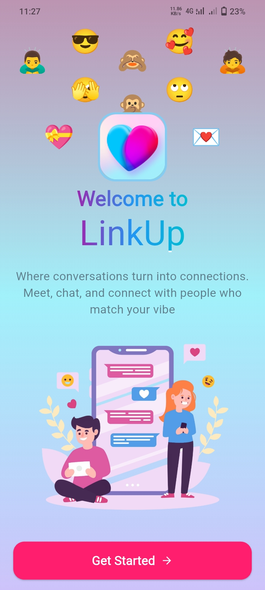
</p>

---

### 🟣 Welcome Screen
**Welcome to LinkUp**  
User can proceed to sign in or create a new account.

<p align="center">
  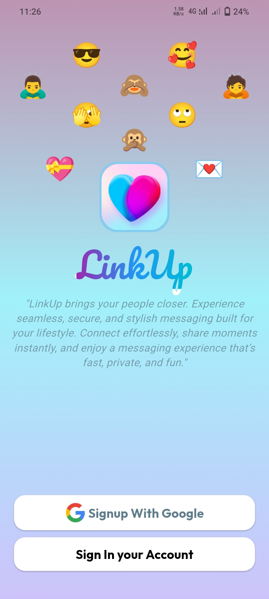
</p>

---

### 🟣 Create Account Screen
**Create LinkUp Account**  
User registration using email or Google sign-in.

<p align="center">
  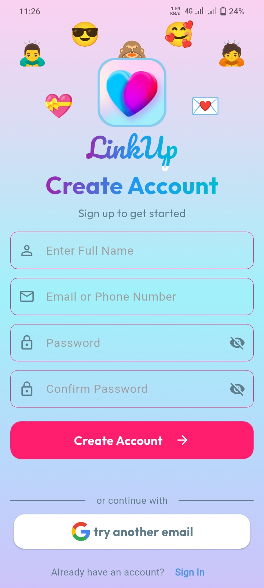
</p>

---

### 🟣 Gender Selection Screen
**Select Your Gender**  
Helps personalize the user experience.

<p align="center">
  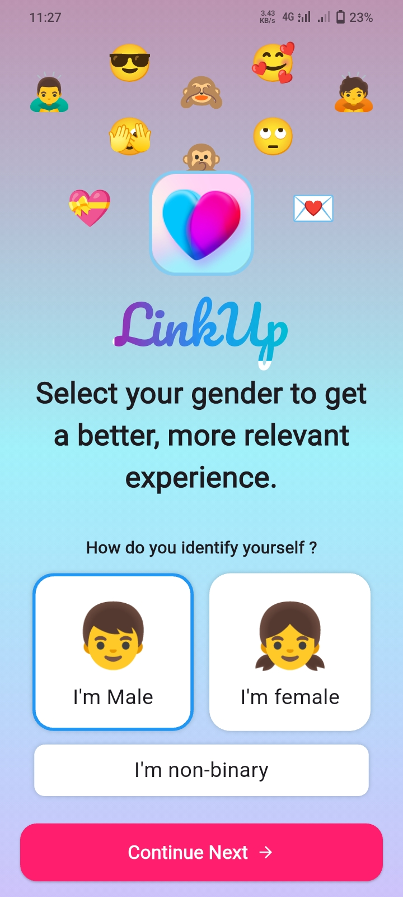
</p>

---

### 🟣 Birthday Selection Screen
**Your Birthday**  
Used for profile personalization.

<p align="center">
  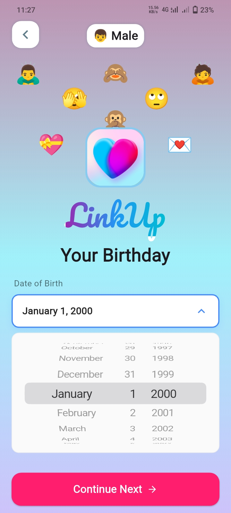
</p>

---

### 🟣 Avatar Upload Screen
**Your Avatar**  
Upload a profile picture to help others recognize you.

<p align="center">
  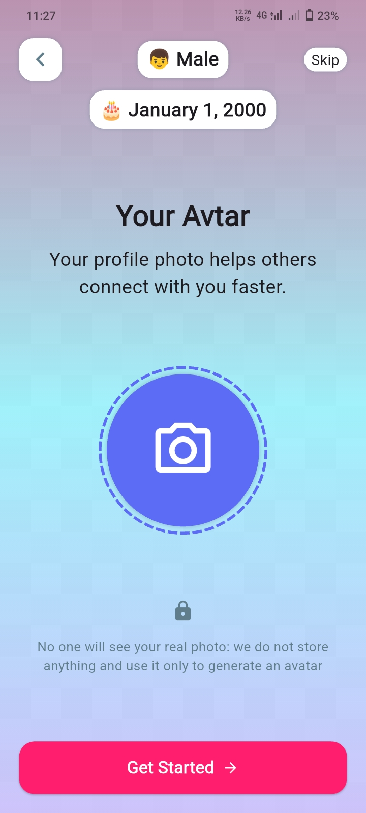
</p>

---

### 🟣 New Chat Screen
**Start a New Chat**  
Search users and start conversations.

<p align="center">
  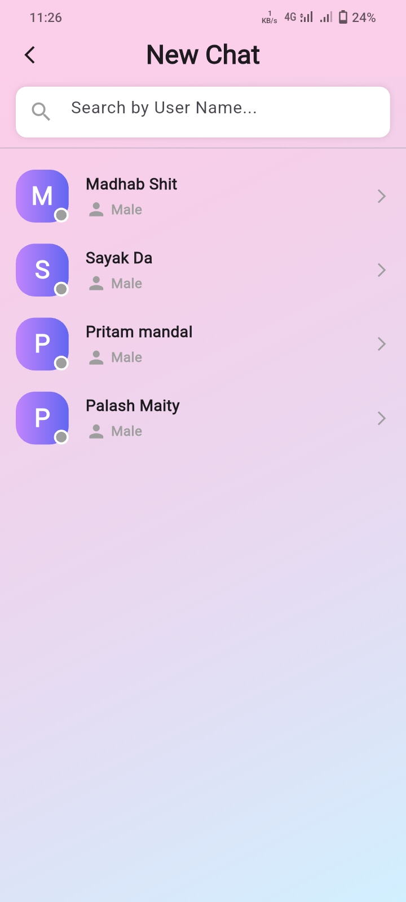
</p>

---

### 🟣 Recent Chats Screen
**Recent Messages**  
Shows all recent conversations.

<p align="center">
  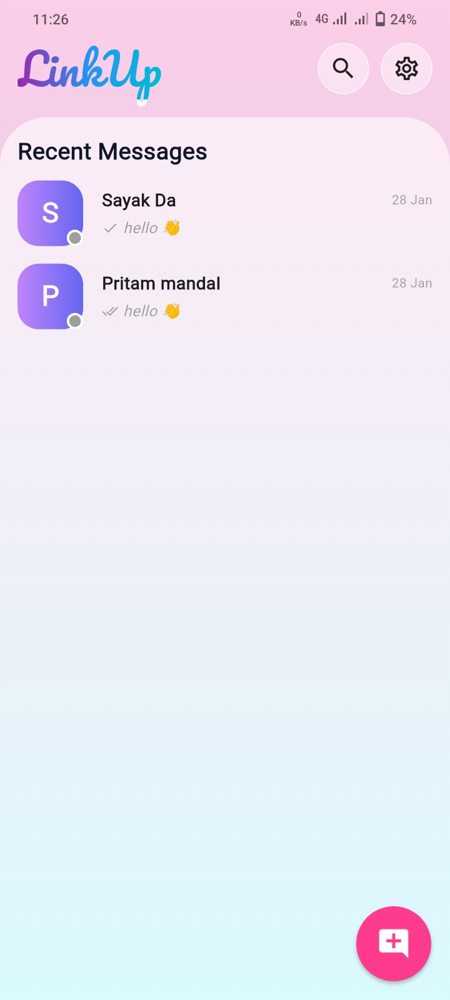
</p>

---

### 🟣 Chat Screen
**Chat Conversation**  
Real-time messaging interface with smooth UI.

<p align="center">
  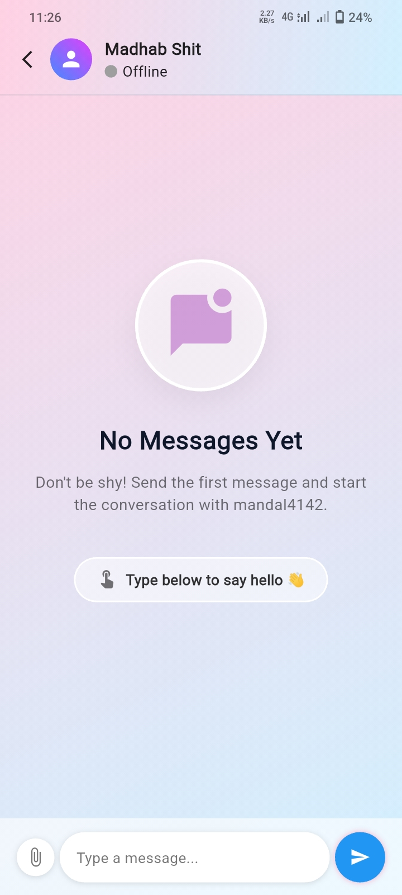
  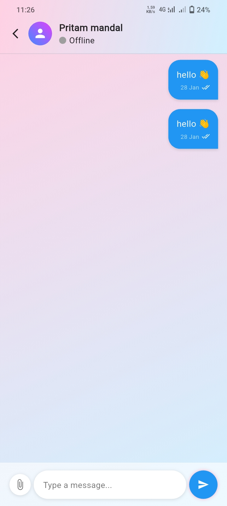
</p>

---

### 🟣 Logout Screen
**Leave LinkUp**  
Secure logout confirmation screen.

<p align="center">
  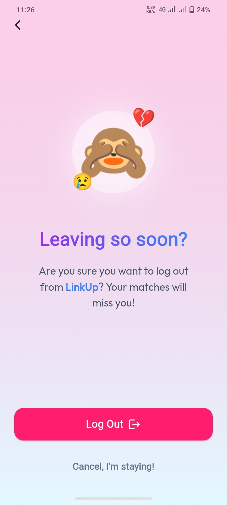
</p>

---

## 🔧 Installation

1️⃣ Clone the repository
```bash
git clone https://github.com/your-username/linkup-chat-app.git
